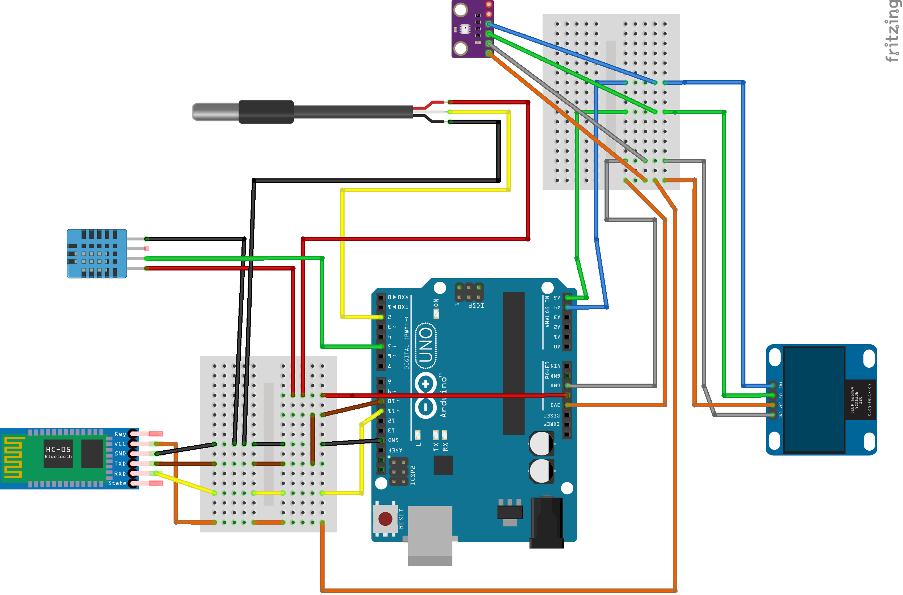

# Arduino weather station

Arduino is used to gather data from various sensors. Data is collected and then wirelessly transmitted to the mobile application.

## Installation 
To use this project, you will need to connect the sensors to the Arduino board according to the wiring diagram provided in the code:



| Component | Description |
| --- | --- |
| DS18B20 | Temperature Sensor |
| DHT11 | Humidity and Temperature Sensor |
| BMP280 | Temperature Sensor and Atmospheric Pressure Sensor |
| HC-05 | Bluetooth Module |
| Arduino Uno (Rev3) | Microcontroller Board |
| OLED 0.96" 128x64 I2C | Display Module |

# Arduino Weather Station Simulator
The Arduino Weather Station Simulator is a simple utility designed to simulate a real Arduino device, particularly focusing on the communication via the Bluetooth interface. This project can be found in the VirtualArduinoSimulator folder. It is designed to help users test and prototype their projects without the need for physical Arduino hardware. The simulator provides a set of commands that simulate the functionality of an actual Arduino Weather Station.

## Table of Commands

| Command | Description  |
| ------- | -------- |
| 1       | Turn LED ON |
| 0       | Turn LED OFF |
| 2       | Send JSON object with data about air temperature, humidity, and snow temperature |

### Example of the JSON output:
```json
{
    "air_temperature": 2.5,
    "humidity": 65.3,
    "snow_temperature": -1.2
}